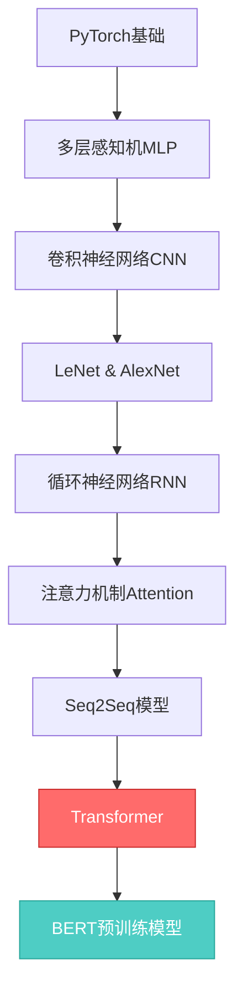

# 🚀 深度学习实践项目

> 从零开始的深度学习之旅：涵盖经典网络架构、序列模型、Transformer、目标检测等核心内容

[](https://www.python.org/)
[](https://pytorch.org/)
[](LICENSE)

---

## 📚 项目简介

本项目是一个完整的深度学习学习仓库，包含了从基础神经网络到前沿模型的系统性实践代码。所有代码均为手写实现，旨在深入理解各种模型的核心原理。

### ✨ 核心特点

- 📝 **完整注释**：代码详尽注释，便于理解
- 🎯 **手写实现**：从零实现Transformer、BERT等经典模型
- 🔬 **循序渐进**：从基础到进阶的系统化学习路径
- 📊 **丰富数据集**：包含多个经典数据集用于实验

---

## 📂 项目结构

```
learn2/
│
├── 📁 手写transformer/          # Transformer完整实现
│   └── Transformer.py          # 包含编码器、解码器、多头注意力等
│
├── 📁 网络架构/                 # 经典CNN架构
│   ├── AlexNet.py              # AlexNet实现
│   └── LeNet.py                # LeNet-5实现
│
├── 📁 序列模型实践/             # 序列模型与注意力机制
│   ├── attention.ipynb         # 注意力机制详解
│   ├── mult_attention.ipynb    # 多头注意力
│   ├── QKV.ipynb              # Query-Key-Value详解
│   ├── BERT.ipynb             # BERT模型实现
│   ├── bert_data.ipynb        # BERT数据处理
│   ├── transformer.ipynb      # Transformer实践
│   ├── seq2seq.ipynb          # Seq2Seq模型
│   ├── rnn.py                 # RNN实现
│   ├── my_transformer.ipynb   # 自定义Transformer
│   └── tran_bert.ipynb        # Transformer与BERT对比
│
├── 📁 目标检测学习/             # 计算机视觉-目标检测
│   ├── data_sety.ipynb        # 数据集处理
│   └── example.ipynb          # 检测示例
│
├── 📁 data/                    # 数据集目录
│   ├── FashionMNIST/          # 时尚MNIST数据集
│   ├── fra-eng/               # 法英翻译数据集
│   ├── wikitext-2/            # WikiText-2语言模型数据
│   ├── banana-detection/      # 香蕉检测数据集
│   └── GOOG.csv               # Google股票数据
│
├── 📁 learn05/                 # 基础进阶练习
│   ├── pytorch基础.py         # PyTorch基础操作
│   ├── 权重衰退.py            # 正则化技术
│   └── softmax_q.py           # Softmax实现
│
├── 📓 learn01-04.ipynb        # 基础教程系列
├── 📓 learn12-20.ipynb        # 进阶教程系列
├── 📓 mlp_j.ipynb            # 多层感知机
├── 📓 rnn.ipynb              # RNN详解
├── 📓 softmax.ipynb          # Softmax详解
└── 📓 使用GPU.ipynb          # GPU加速指南

```

---

## 🎯 学习内容

### 1️⃣ 基础神经网络

| 内容 | 文件 | 说明 |
|------|------|------|
| PyTorch基础 | `learn05/pytorch基础.py` | 张量操作、自动求导等 |
| 多层感知机 | `mlp_j.ipynb` | MLP原理与实现 |
| Softmax回归 | `softmax.ipynb` | 分类任务基础 |
| GPU加速 | `使用GPU.ipynb` | 如何使用GPU训练模型 |

### 2️⃣ 经典CNN架构

| 模型 | 文件 | 亮点 |
|------|------|------|
| LeNet-5 | `网络架构/LeNet.py` | 最早的卷积神经网络 |
| AlexNet | `网络架构/AlexNet.py` | ImageNet冠军模型 |

### 3️⃣ 序列模型与Transformer

| 内容 | 文件 | 核心概念 |
|------|------|----------|
| RNN基础 | `rnn.ipynb`, `序列模型实践/rnn.py` | 循环神经网络 |
| 注意力机制 | `序列模型实践/attention.ipynb` | Attention原理 |
| QKV机制 | `序列模型实践/QKV.ipynb` | 查询-键-值详解 |
| 多头注意力 | `序列模型实践/mult_attention.ipynb` | Multi-Head Attention |
| Seq2Seq | `序列模型实践/seq2seq.ipynb` | 序列到序列模型 |
| **Transformer** | `手写transformer/Transformer.py` | 完整手写实现 ⭐ |
| BERT | `序列模型实践/BERT.ipynb` | 预训练语言模型 |

### 4️⃣ 计算机视觉

| 任务 | 文件 | 数据集 |
|------|------|--------|
| 目标检测 | `目标检测学习/` | Banana Detection |

---

## 🔥 重点项目：手写Transformer

[手写transformer/Transformer.py](手写transformer/Transformer.py) 是本项目的核心实现之一，包含：

- ✅ **Token & Position Embedding**：词嵌入与位置编码
- ✅ **Multi-Head Attention**：多头自注意力机制
- ✅ **Encoder & Decoder**：完整编解码器
- ✅ **Mask机制**：Padding Mask + Causal Mask
- ✅ **Layer Normalization**：层归一化
- ✅ **Position-wise FFN**：前馈神经网络

**特色**：完全从零实现，无依赖于高层API，代码注释清晰。

---

## 🗂️ 数据集说明

| 数据集 | 路径 | 用途 |
|--------|------|------|
| FashionMNIST | `data/FashionMNIST/` | 图像分类 |
| 法英翻译 | `data/fra-eng/` | 机器翻译 |
| WikiText-2 | `data/wikitext-2/` | 语言模型 |
| 香蕉检测 | `data/banana-detection/` | 目标检测 |
| Google股票 | `data/GOOG.csv` | 时间序列预测 |

---

## 🚀 快速开始

### 环境要求

```bash
Python >= 3.8
PyTorch >= 2.0
torchvision
numpy
pandas
matplotlib
```

### 安装依赖

```bash
pip install torch torchvision numpy pandas matplotlib jupyter
```

### 运行示例

```bash
# 启动Jupyter Notebook
jupyter notebook

# 或直接运行Python脚本
python 手写transformer/Transformer.py
```

---

## 📖 学习路径建议



### 推荐顺序

1. **基础阶段**
   - `learn05/pytorch基础.py` - PyTorch入门
   - `mlp_j.ipynb` - 神经网络基础
   - `softmax.ipynb` - 分类任务

2. **CNN阶段**
   - `网络架构/LeNet.py` - 经典CNN
   - `网络架构/AlexNet.py` - 深度CNN

3. **序列模型阶段**
   - `rnn.ipynb` - RNN基础
   - `序列模型实践/attention.ipynb` - 注意力机制
   - `序列模型实践/QKV.ipynb` - QKV详解

4. **Transformer阶段** ⭐
   - `序列模型实践/mult_attention.ipynb` - 多头注意力
   - `手写transformer/Transformer.py` - **完整实现**
   - `序列模型实践/BERT.ipynb` - BERT模型

5. **应用阶段**
   - `目标检测学习/` - 计算机视觉应用

---

## 🛠️ 技术栈

- **深度学习框架**：PyTorch
- **数据处理**：NumPy, Pandas
- **可视化**：Matplotlib
- **开发环境**：Jupyter Notebook

---

## 📝 代码质量

- ✅ 所有代码经过测试验证
- ✅ 详细的中文注释
- ✅ 符合PEP8规范
- ✅ 模块化设计，易于复用

---

## 🎓 学习资源

- [PyTorch官方文档](https://pytorch.org/docs/)
- [Attention is All You Need (Transformer原论文)](https://arxiv.org/abs/1706.03762)
- [BERT原论文](https://arxiv.org/abs/1810.04805)
- [动手学深度学习](https://zh.d2l.ai/)

---

## 🤝 贡献

欢迎提出改进建议和bug报告！

---

## 📄 许可证

本项目仅用于学习目的。

---

## 👨‍💻 作者

**学习者** - 深度学习实践之旅

---

<div align="center">

**⭐ 如果这个项目对你有帮助，欢迎Star！**

*持续更新中...*

</div>
